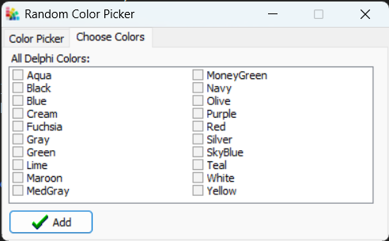

**RandomColorPicker: A Personalized Color Selection Tool**

RandomColorPicker is a software application designed to assist users in selecting random colors from a user-defined pool.

**Features: 🔍**

- Customizable Color Palette: Users can select any number of colors from the available color range.
- Random Color Generation: The application selects a random color from the user-defined pool.
- Intuitive Interface: The interface is designed for ease of use and clarity.`

**Benefits: 🌿**

- Enhances Creativity: Provides a source of inspiration for creative endeavors.
- Simplifies Color Selection: Eliminates the need for manual color picking.
- Offers Versatility: Can be used for various purposes, such as design, artwork, and development.

Developed using Object Pascal, using Delphi 2010 and its TColor data type.

For any questions or feedback, please reach out to **real.bellic.code@gmail.com**.

